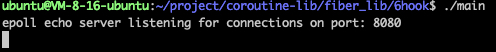

# 项目概述

本项目是对sylar服务器框架的改编和简化，专注于协程库的部分。通过引入协程、调度器和定时器等核心模块，利用HOOK技术将Linux系统中的传统同步函数（如 `sleep`、`read`、`write` 等）转化为异步版本。此改造允许保持同步I/O的编程方式，同时享受异步执行的效率和响应速度提升。

## 运行环境

Ubuntu 22.04 LTS

## 编译指令

首先进入文件所在目录
```shell
cd coroutine-lib && cd fiber_lib && cd 6hook 
```

在6hook文件下编译链接可执行文件
```shell
g++ *.cpp -std=c++17 -o main -ldl -lpthread
```

执行可执行文件
```shell
./main
```
如图： 



### 测试工具的使用：
在ubuntu安装
```shell
sudo apt update
sudo apt install apache2-utils
```

判断是否安装成功
```shell
ab -V
```

### 通过测试工具运行项目:

**注意别忘记启动main可执行程序，并且额外开一个窗口执行以下内容**

测试工具apache的命令使用的是:

```shell
ab -n 100 -c 10  http://127.0.0.1:8080/
```

命令会模拟 ​​10 个并发用户​​（-c 10），持续向 http://127.0.0.1:8080/ 发送请求，直到累计完成 ​​100 次请求​​（-n 100）。

如图： 


* -n 连接数
* -c 并发数

可以根据自己的服务器的CPU数量，适当调整 测试连接数 和 并发数的数量。

## 主要模块介绍

### 协程类
* 使用非对称的独立栈协程。
* 支持调度协程与任务协程之间的高效切换。

### 调度器
* 结合线程池和任务队列维护任务。
* 工作线程采用FIFO策略运行协程任务，并负责将epoll中就绪的文件描述符事件和超时任务加入队列。

### 定时器
* 利用最小堆算法管理定时器，优化超时回调函数的获取效率。

## 关键技术点

* 线程同步与互斥
* 线程池管理
* epoll的事件驱动模型
* Linux网络编程
* 泛型编程
* 同步与异步I/O
* HOOK技术

## 核心概念详解
### 同步I/O（Synchronous I/O）
应用程序执行I/O操作必须等待操作完成，期间应用程序被阻塞，无法执行其他任务。

### 异步I/O（Asynchronous I/O）
应用程序可以在I/O操作执行过程中继续执行其他代码，I/O操作通过事件回调机制完成通知。

### HOOK技术
对系统底层函数进行封装，增强功能且保持原有调用接口的兼容性，使函数在保持原有调用方式的同时，增加新的功能实现。

采用外挂式 Hook 技术​​，利用动态链接器的全局符号介入（Global Symbol Interposition）机制，通过优先加载自定义动态库来覆盖（Hook）目标程序中对系统库函数（如 write）的调用。

Hook 原理​​
- 你编写的 libhook.so 包含自定义的 write 函数。
- 通过 LD_PRELOAD=./libhook.so 启动程序时，系统先加载 libhook.so，其 write 符号加入全局符号表。
- 当程序后续加载 libc.so 时，链接器发现全局符号表已有 write，会跳过 libc 中的版本。
- 程序调用 write 时，实际执行的是你自定义的函数 。

编译过程
- 假设你有以下文件：hook.cpp hook.h
- 执行以下命令：
```bash
# 编译所有必要源文件生成 libhook.so
g++ -fPIC -shared -o libhook.so \
    hook_ly.cpp \
    ioscheduler_ly.cpp \
    fd_manager_ly.cpp \
    fiber_ly.cpp \
    thread_ly.cpp \
    timer_ly.cpp \
    scheduler_ly.cpp \
    -ldl -lpthread
```
- -  `​-fPIC`​​：生成位置无关代码（必需）。`​​-shared​​`：生成共享库（.so）。

使用Hook
- LD_PRELOAD="./libhook.so" ./test_have_hook